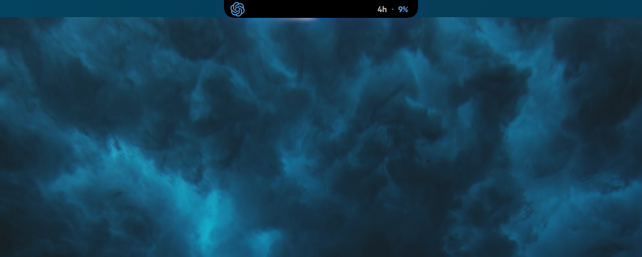
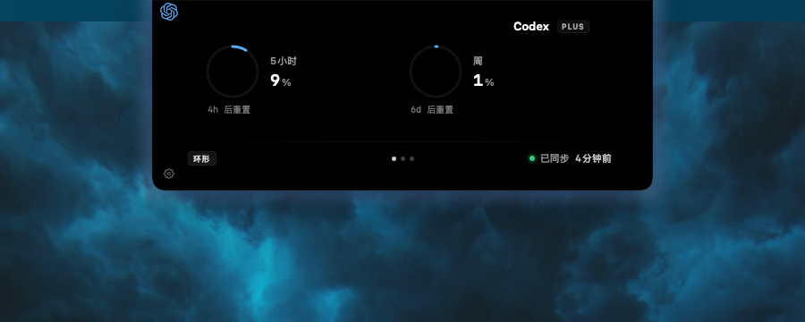
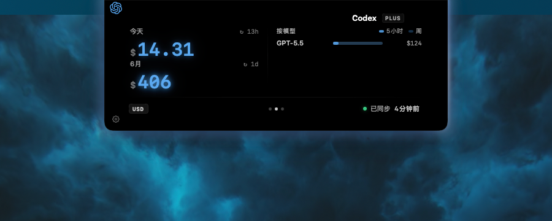
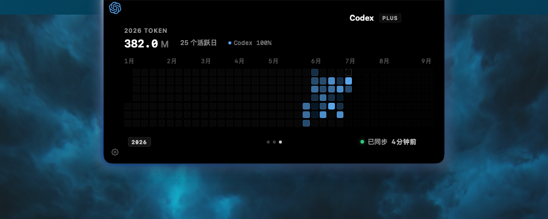
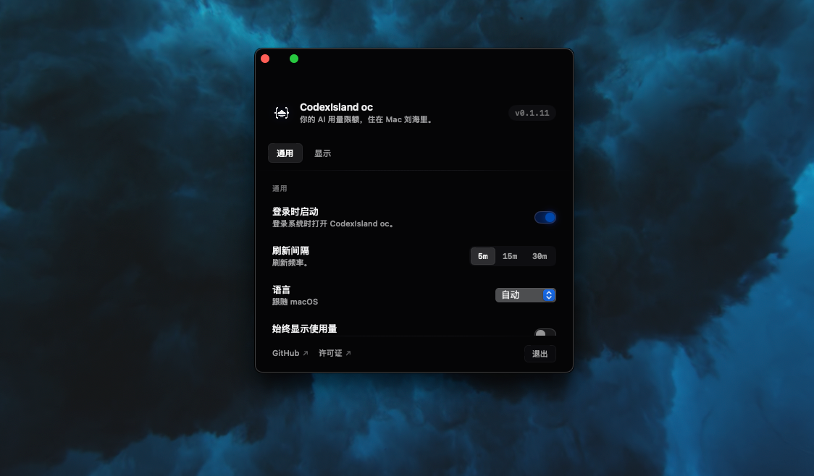
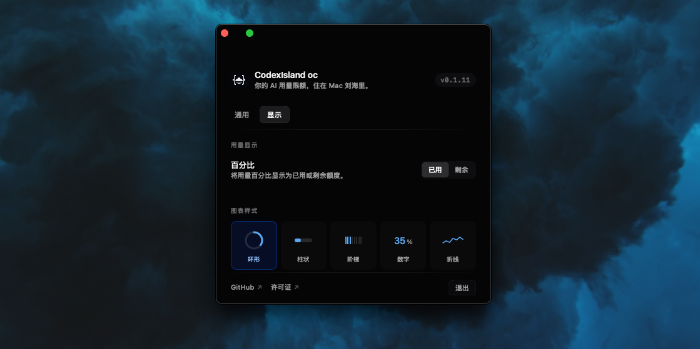

# CodexIsland oc

## Forked From: [ericjypark/codex-island](https://github.com/ericjypark/codex-island)

[English](README.md) | [简体中文](README.zh-CN.md)

<p align="center">
  
</p>

> Codex usage, cost, and token activity living quietly in your Mac notch.

CodexIsland oc is a Codex-only fork of
[CodexIsland](https://github.com/ericjypark/codex-island), a native macOS
overlay that turns the MacBook notch into a Dynamic-Island-style live activity.
The original app supports both Claude Code and Codex. I only use Codex in my
daily workflow, and when Claude Code is hidden the original two-provider layout
can leave visible empty space and an unbalanced island. This fork keeps the
local-first spirit of the original project, removes Claude-oriented UI from the
main experience, and reshapes the notch, usage, cost, and settings views around
a single Codex-focused display.

### Preview

<p align="center">
  
  
</p>

<p align="center">
  
  
  
</p>

<p align="center">
  
  
</p>

The app is free, open source, unsigned, and local-first. It reads Codex auth
state already written on your Mac, fetches Codex usage, and estimates cost and
token throughput from local Codex session logs.

## What It Does

- **Codex-only island.** The compact notch and expanded panel are designed for
  one provider instead of reserving space for Claude.
- **Notch-native overlay.** The compact state is a black pill aligned to the
  physical notch. On non-notched Macs it falls back to a compact menu-bar pill.
- **Always-visible compact usage.** The Codex mark and usage headline can stay
  visible in the notch without hovering.
- **Click to expand.** Click the island to open the full Usage / Cost /
  Overview panel.
- **Swipe between pages.** Drag left or right on the expanded panel, or click
  the indicator dots, to switch between Usage, Cost, and Overview.
- **Cost screen.** The Cost page estimates today and month-to-date spend, token
  totals, value, and trend from local Codex logs.
- **Token counting modes.** Choose all tokens or input + output only.
- **Chart styles.** Ring, Bar, Stepped, Numeric, and Sparkline remain available
  for Codex usage.
- **On-demand refresh.** Click the sync status in the panel to refresh
  immediately.
- **Low Power Mode.** Hide steady-state glow so the island only pulses during
  active refresh, hover, or limit alerts.
- **Settings without a Dock icon.** A small gear in the expanded panel opens a
  custom settings window for launch-at-login, refresh cadence, display style,
  target display, language, token counting, and Quit.
- **Universal binary.** `build.sh` compiles arm64 and x86_64 slices and merges
  them with `lipo`, targeting macOS 13+.
- **No bundled auto-update channel.** This fork intentionally removes Sparkle
  auto-update and the upstream Homebrew tap flow so it does not mix with the
  original author's release channel.
- **Native app privacy.** No app telemetry, no crash reporting, no third-party
  analytics, and no proxy service.

## Install

### Direct Download

Download `CodexIsland-oc-X.Y.Z.dmg` from this repository's
[Releases](../../releases), drag `CodexIsland oc.app` to `/Applications`, then
run:

```sh
xattr -dr com.apple.quarantine "/Applications/CodexIsland oc.app"
```

<details>
<summary>Why is the dequarantine command necessary?</summary>

CodexIsland oc is unsigned. The command removes the macOS Gatekeeper
quarantine attribute that triggers the "cannot be opened because Apple cannot
check it for malicious software" warning. The source code is available in this
repository for audit.
</details>

<details>
<summary>I do not want to use Terminal. What do I do?</summary>

1. Drag `CodexIsland oc.app` to `/Applications`.
2. Try to open it. macOS will block it because the build is unsigned.
3. Open **System Settings -> Privacy & Security**.
4. Scroll to the bottom and find the blocked CodexIsland oc message.
5. Click **Open Anyway**, then re-launch the app.
</details>

## First Run

CodexIsland oc does not ask for passwords or API keys. It reads the auth state
already created by Codex / ChatGPT CLI.

For Codex:

- Sign in to Codex / ChatGPT CLI first.
- CodexIsland oc reads `~/.codex/auth.json`.
- If the file or access token is missing, the panel shows `no codex auth`.

The first fetch starts at app launch so the panel usually has values ready by
the first peek. Opening Settings also triggers a fresh fetch.

## Using The App

- Hover the notch to peek at current Codex usage.
- Click the island to expand the full panel.
- Drag left or right on the expanded panel, or click the bottom dots, to switch
  between **Usage**, **Cost**, and **Overview**.
- Move away to collapse it.
- Click the sync status to refetch immediately.
- Click the gear in the lower-left corner of the expanded panel to open
  Settings.
- Use Settings to enable Launch at Login, pick a refresh interval, toggle Low
  Power Mode, choose usage display mode, choose chart and cost styles, choose
  token counting mode, select a target display, open GitHub / License, or quit
  the app.

## Settings

Settings is a custom `NSWindow`, not the system Settings scene. The app runs as
an accessory app with no Dock icon and no menu bar.

Stored preferences:

| Setting | Store | UserDefaults key | Values |
| --- | --- | --- | --- |
| Chart style | `StylePref` | `MacIsland.chartStyle` | `ring`, `bar`, `stepped`, `numeric`, `spark` |
| Cost style | `CostStylePref` | `MacIsland.costStyle` | `dollar`, `multi`, `tokens`, `spark` |
| Token counting | `TokenCountModeStore` | `MacIsland.tokenCountMode` | `all`, `billable` |
| Usage display | `UsageDisplayModeStore` | `MacIsland.usageDisplayMode` | `used`, `remaining` |
| Refresh interval | `RefreshIntervalStore` | `MacIsland.refreshInterval` | `300`, `900`, `1800` |
| Always show usage | `AlwaysShowUsageStore` | `MacIsland.alwaysShowUsage` | Boolean |
| Low Power Mode | `LowPowerModeStore` | `MacIsland.lowPowerMode` | Boolean |
| Launch at login | `LaunchAtLoginStore` | managed by `SMAppService.mainApp` | System login item status |

The refresh interval applies live. `UsageStore` invalidates the current timer
and re-arms it with the selected cadence.

## Build From Source

Requires macOS 13+ and a Swift toolchain from Xcode / Command Line Tools.

```sh
git clone https://github.com/weiweidounai0131/codex-island-only-codex
cd codex-island-only-codex
./build.sh
open "build/CodexIsland oc.app"
```

There is no Xcode project and no SwiftPM package. `build.sh` runs `swiftc` over
`Sources/**/*.swift`, compiles arm64 and x86_64 slices, merges them with
`lipo`, copies bundled resources, and writes `Info.plist`.

Smoke test the native app:

```sh
./scripts/verify.sh
```

The script builds the app, launches the binary for one second, then kills it if
it is still alive.

## Release

Package a DMG:

```sh
npm install --global create-dmg
./release.sh
```

`release.sh` runs the native build, copies the `.app` to `dist/`, applies
ad-hoc codesigning, creates `dist/CodexIsland-oc-X.Y.Z.dmg`, and prints the
file size and SHA-256.

Pushing a `v*` tag triggers `.github/workflows/release.yml` on `macos-15`,
builds the DMG, computes the checksum, and publishes a GitHub Release.

## Repository Layout

```text
.
├── Sources/
│   ├── App.swift
│   ├── Cost/                # Local Codex log cost + token aggregation
│   ├── Model/
│   ├── Theme/
│   ├── Usage/
│   ├── Views/
│   └── Window/
├── Resources/              # App-bundled logos, icons, localization
├── Assets/                 # README logo asset
├── docs/images/            # README screenshots
├── scripts/verify.sh       # Native smoke test
├── build.sh                # Universal .app build
├── release.sh              # DMG packaging
└── VERSION
```

## Privacy

Native app behavior:

- No app telemetry.
- No app analytics.
- No crash reporting.
- No proxy server.
- No credentials are stored by CodexIsland oc.
- Codex tokens are read locally from `~/.codex/auth.json`.
- The Cost screen reads local Codex session logs from your machine.
- Network requests go directly to Codex/OpenAI endpoints used for usage data.

## Troubleshooting

**The app will not open after download.**

Run:

```sh
xattr -dr com.apple.quarantine "/Applications/CodexIsland oc.app"
```

**Codex shows no auth.**

Sign in to Codex / ChatGPT CLI first, then restart CodexIsland oc.

**The island appears on the wrong monitor.**

Open Settings and choose the target display, or leave it on Auto so the app
prefers a notched display when available.

## Credits

This project is a Codex-only fork of
[ericjypark/codex-island](https://github.com/ericjypark/codex-island). The
original project, app concept, native macOS architecture, and MIT license come
from Eric Park's work.

## License

MIT. See [LICENSE](LICENSE).
